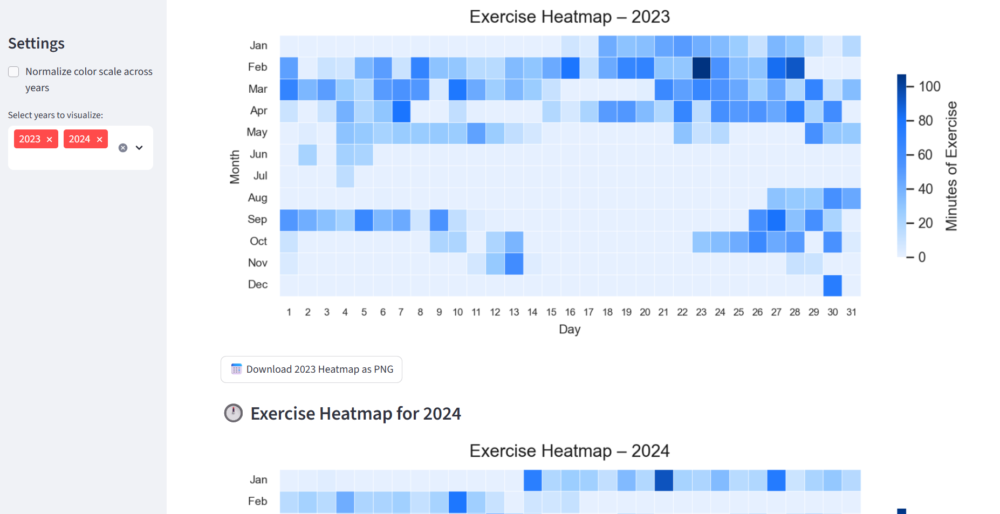

<<<<<<< HEAD
# Heatmap My Training 📊

Visualize your Apple Health exercise data with heatmaps.  
Just upload your `export.xml` or a filtered `.csv` and instantly see your training trends for the year. **No code required!**

---

## ✨ Features

* 🌍 Streamlit web app – just open and upload  
* 🔢 Aesthetic heatmap design  
* 📊 Multiple years side by side  
* 💡 Normalize color scales across years (optional)  
* 📂 Export heatmaps as PNG  
* ❤️ Easy to use, no technical knowledge needed  

---

## 🔄 Try it Live

> [https://your-username.streamlit.app](https://heatmap-my-training.streamlit.app/)  
> *(Replace with your real URL after deployment)*

---

## 🔍 Example

  
*See how your training consistency evolves over the year!*

---

## 🎓 How to Use

1. **Export your Apple Health data** from your iPhone:

   * Open the Health app → Profile → Export All Health Data  
   * Save the `.zip`, extract it, and locate the `export.xml`  
   * Full guide: [How to extract Apple Health data](https://medium.com/@filipacsr/how-to-extract-and-analyze-apple-health-data-with-r-7d28029d22bd)

2. **(Optional but recommended)** Filter the XML to reduce size and extract only relevant data:

   The file `filter_health_data.py` helps with this:
   ```bash
   python filter_health_data.py      --input export.xml      --output filtered_data.csv      --types HKWorkoutType HKQuantityTypeIdentifierDistanceWalkingRunning
   ```
   This creates a smaller CSV file focused on your training data.

3. **Run the app locally**:
   ```bash
   pip install -r requirements.txt
   streamlit run app.py
   ```

   Or **upload to Streamlit Cloud** to share it online with a link.

---

## 📁 Project Structure

```
heatmap-my-training/
├── app.py                   # Streamlit interface
├── heatmap_design.py       # Apple-style heatmap plot function
├── convert_xml_to_csv.py   # Optional: convert raw XML to full CSV
├── filter_health_data.py   # NEW: filter large XML to focused CSV
├── requirements.txt        # Dependencies
├── README.md               # This file
└── .streamlit/
    └── config.toml         # (Optional) UI settings
```

---

## 🚀 Deployment (optional)

1. Push this repo to GitHub  
2. Go to [Streamlit Cloud](https://streamlit.io/cloud)  
3. Click **"New App"** and select this repo + `app.py`

---

## ☕ Support This Project

If you enjoy it, [Buy Me a Coffee](https://www.buymeacoffee.com/filipacsr) ☕

---

Built with ❤️ by [Filipa](https://medium.com/@filipacsr)
=======
---
title: Heatmap My Training
emoji: 🚀
colorFrom: red
colorTo: red
sdk: docker
app_port: 8501
tags:
- streamlit
pinned: false
short_description: Visualize your Apple Health training as elegant heatmaps.
license: mit
---

# Welcome to Streamlit!

Edit `/src/streamlit_app.py` to customize this app to your heart's desire. :heart:

If you have any questions, checkout our [documentation](https://docs.streamlit.io) and [community
forums](https://discuss.streamlit.io).
>>>>>>> abc3b9a659537441f2242afba5e55921910754e9
